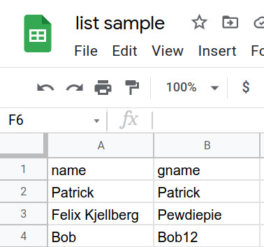

# Attendance marker (GMeet)

A Chrome extension which allows you to take attendance for college classes. 

## How to use?

1. You need to add the list of students (only for the first time) to take the attendance.
2. After that join the google meet and **open participants list**.
3. Open the extension and select branch and semester in which you have uploaded the students list and click 'Take Attendance'

It will show students who are absent and names of people who isn't on the students list but is present in the meet.

## How to upload?

1. Open the extension and select the branch and semester to which you want to upload the list.
2. If you haven't uploaded any files before, you will see an upload button which will take you to a new tab. If you want to modify existing list read step 5
3. Click on the upload file button and select the csv file you wish to upload 
4. Click 'read csv'
5. You can previously uploaded list by going to settings page and clicking 'clear database'. (Note that this will clear all the lists uploaded)

## How to create csv file?

1. Create a google sheet with 2 columns ⇒ name & gname. Where name is the name of student and gname is the name on their google account or GMeet

2. Click File > Download > csv
