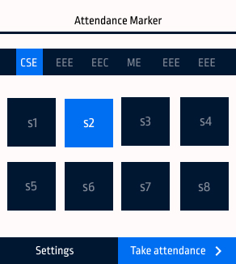
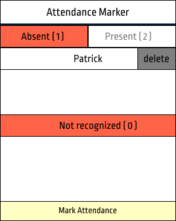
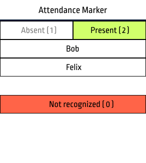

# Attendance marker (GMeet)

A Chrome extension which allows you to take attendance for college classes. It can record attendance daily for multiple classes and then allows you to download it 
as a csv file.

___

 < >  
___
## How to install?
#### From .crx file
1. Click on the latest release (right side of this page)
2. In the assets listed click 'attendanceMarker_gmeet.crx' which will start 
downloading the file
3. Open chrome and go to Settings > Extensions and turn on developer mode
4. Drag the downloaded crx file to the extensions page
#### From source code
1. Clone this repository or download as zip by clicking green coloured 'code' 
button
on top of this page and extract it
2. Open chrome and go to settings > Extensions and turn on developer mode
3. Click 'load unpacked' and select the folder you have downloaded
4. Click extensions icon on top bar and pin Attendance Marker for easier access 
 
## How to use?

1. You need to add the list of students (only for the first time) to take the
 attendance.
2. After that join the google meet and **open participants list**.
3. Open the extension and select branch and semester in which you have uploaded
 the students list and click 'Take Attendance'
4. It will show students who are absent and names of people who isn't on the 
students list but is present in the meet.
	Click 'Mark Attendance' to save this record. 
5. (You can remove students from absent list by clicking delete button near 
their name 
and click 'Mark Attendance')

Attendance is recorded with date as a key so marking attendance multiple times
a day will just overwrite that day's record.
## How to upload?

1. Open the extension and select the branch and semester to which you want to 
upload the list.
2. If you haven't uploaded any files before, you will see an upload button which
 will take you to a new tab. If you want to modify existing list read step 5
3. Click on the upload file button and select the csv file you wish to upload 
4. Click 'read csv'
5. You can previously uploaded list by going to settings page and clicking
'clear database'. (Note that this will clear all the lists uploaded)

## How to create csv file?
To create acceptable list of students follow any of the following methods.
> Automaticaly create list with extension

1. Open participants list in Google meet 
2. Open extension and go to settings (left bottom) 
3. Click 'Get Participants' Button

A csv sheet will be downloaded which you can upload to the extension. 
(If you have missed anyone add them to this downloaded list in the format shown below)

 

> Manually creating list

1. Create a google sheet with 2 columns ⇒ name & gname. Where name is the 
name of student and gname is the name on their google account or GMeet

2. Click File > Download > csv

## How to download attendance sheet?

1. Select the branch and sem in home page.
2. Click Download icon on bottom left.
